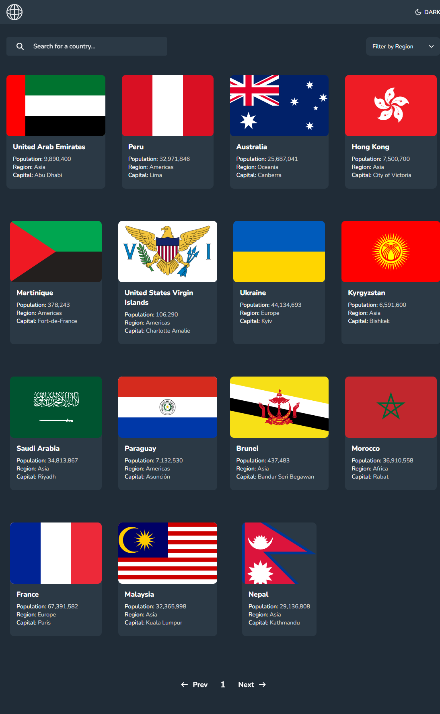

## Overview

### The challenge

Users should be able to:

- See all countries from the API on the homepage
- Search for a country using an `input` field
- Filter countries by region
- Click on a country to see more detailed information on a separate page
- Click through to the border countries on the detail page
- Toggle the color scheme between light and dark mode *(optional)*

### Screenshot

;

### Links

## My process

### Built with
- HTML5 Markup.
- CSS custom properties.
- Typescript.
- Webpack bundler.
- REST Countries API.
- Leaflet (for mapping country borders with geoJSON).

